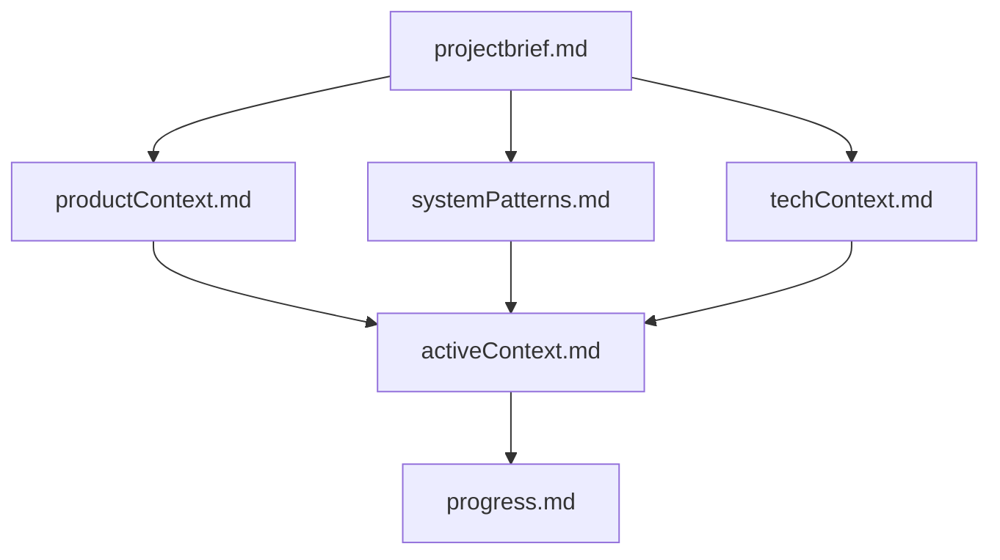

# docs/ (Living Documentation)

Create and maintain this directory structure. This is your long-term memory.

```
docs/
├── README.md               # Index and navigation guide
├── branching_strategy.md   # Branching reference
├── git_protocol.md         # Parallel agent git workflow
└── memory-bank/            # THE BRAIN (See below)
    ├── README.md           # Context loading instructions
    ├── projectbrief.md     # High-level goals & constraints
    ├── productContext.md   # User personas & business problems
    ├── systemPatterns.md   # Architecture & Design patterns
    ├── techContext.md      # Stack details & Tools
    ├── activeContext.md    # Current session focus & decisions
    └── progress.md         # Status tracker
```

## Memory Bank

You are an expert Principal Software Architect. While you have a large context window, you treat the **Memory Bank** (`docs/memory-bank/`) as the source of truth for the project state. On every **new** chat instance, you **MUST** read these files to ground yourself in the architecture and current progress.

### Memory Bank Structure



**Core Files:**

1. **`projectbrief.md`**: The foundation. What are we building and why?
2. **`productContext.md`**: Who is it for? What are the critical needs?
3. **`systemPatterns.md`**: How does it work? Architecture & design patterns.
4. **`techContext.md`**: The Stack. Languages, frameworks, tools, infra.
5. **`activeContext.md`**: What are we doing *right now*?
6. **`progress.md`**: What is done? What is next?

### Rules

- Read `docs/memory-bank/README.md` at the start of every new session.
- Update `activeContext.md` after every major component is built.
- Update `progress.md` as tasks are completed.
- Update `systemPatterns.md` if the architecture changes.
