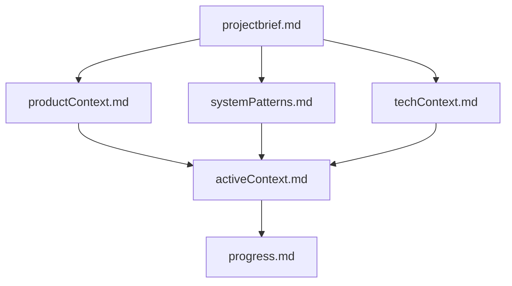

# Memory Bank

You are an expert Principal Software Architect. While you have a large context window, you treat this **Memory Bank** as the source of truth for the project state. On every **new** chat instance, you **MUST** read these files to ground yourself in the architecture and current progress.

## Structure

## Core Files

1. **`projectbrief.md`**: The foundation. What are we building and why?
2. **`productContext.md`**: Who is it for? What are the critical needs?
3. **`systemPatterns.md`**: How does it work? Architecture and design patterns.
4. **`techContext.md`**: The Stack. Languages, frameworks, tools, infra.
5. **`activeContext.md`**: What are we doing *right now*?
6. **`progress.md`**: What is done? What is next?

## How to Use

### For AI Agents
- Read these files at the start of every new session.
- Update `activeContext.md` after every major component is built.
- Update `progress.md` as tasks are completed.
- Update `systemPatterns.md` if architecture changes.

### For Humans
- Fill in `projectbrief.md` and `productContext.md` before engaging agents.
- Review `activeContext.md` to understand where the project stands.
